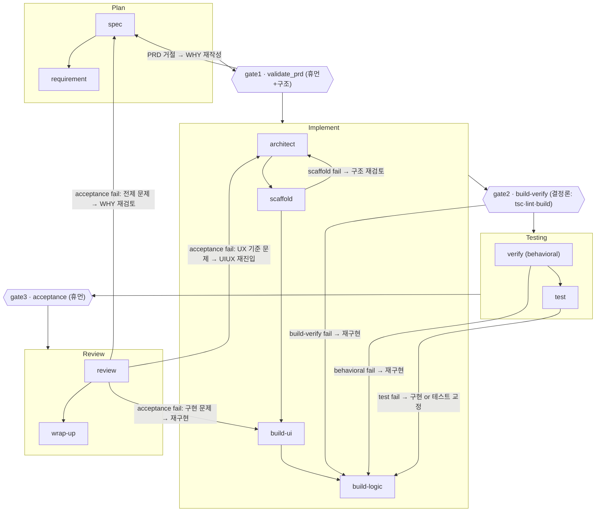

# AGENTS.md — Frontend Team Governance (harness-neutral)

> 이 문서는 **하네스 중립 헌법**이다. 파이프라인·step 스펙(WHO)·게이트·문서 계약의 **단일 출처(SSOT)**.
> 특정 도구(Claude Code / Codex)는 이 문서를 **어댑터**로 참조한다:
> - Claude Code → `CLAUDE.md` + `.claude/agents/*` + `.claude/settings.json`(hooks)
> - Codex(향후) → `.codex/*` 어댑터만 추가
>
> 어댑터는 "누가 실행하고 어떤 도구를 쓰는가"만 다르게 하고, **역할·읽는 문서·쓰는 문서·통과 게이트는 이 문서를 그대로 따른다.**

---

## 0. 대원칙

1. **상태는 컨텍스트가 아니라 파일에 산다.** 에이전트는 기억이 아니라 `docs/`를 읽고 쓴다. 핸드오프는 `docs/runtime/session.md`로.
2. **State는 얼고(freeze), Runtime은 흐른다(mutate).** State 문서 수정은 명시적 재진입을 요구한다.
3. **게이트는 두 종류다.** 결정론(도구가 pass/fail) + 휴먼(사람이 승인). 결정론은 자동 차단, 휴먼은 사람 확인 없이는 통과 못함.
4. **얇게 시작한다.** Constraints는 실재 도구가 있는 것만 hard. 나머지는 soft로 두고 반복 위반이 도구화되면 승격(moving boundary).

---

## 1. 컨텍스트 맵 (무엇을 어디서 읽고 쓰나)

```
docs/state/        read-mostly, 게이트에서 freeze
  PRD.md               WHY            (freeze: gate1)
  Domain.md            어휘·규칙       (freeze: gate1)
  UIUX.md              WHAT(사용자경험) (freeze: Implement 초입, review 재진입 가능)
  TestStrategy.md      검증 기준        (freeze: Implement 초입)
  Constraints.md       hard/soft 제약   (seed: architect, 승격: wrap-up)
  architecture/
    Architecture.md    HOW 상위        (freeze: Implement 초입)
    SDD/               HOW 하위        (draft→frozen: gate2)
    ADR/               결정 이력        (append-only, immutable)

docs/runtime/      mutate
  session.md           work-state 원장  (매 step write, 세션 휘발)
  tasks.md             구현 분해·완료    (완료의 단일 출처, feature 스코프)
  lessons.md           교훈             (append-only, wrap-up write)
  decision-queue.md    미결정           (spec/architect 적재, wrap-up 정리)
  summary.md           사람용 요약       (wrap-up write)
```

읽기/쓰기 권한은 §4 step 표에서 step별로 못박는다. **어떤 step도 자기 권한 밖 문서를 수정하지 않는다.**

---

## 2. 파이프라인



> **REVIEW.md에서 지적한 공백 보정분**이 이 파이프라인에 반영돼 있다:
> - **게이트 3개 + 종류 명시**: gate1(휴먼), gate2(결정론), gate3(휴먼). (기존 2개→3개, 각 종류 태깅)
> - **용어 분리**: `build-verify`(gate2, 정적 tsc/lint/build) ≠ `verify`(Testing, behavioral). 같은 단어 혼용 제거.
> - **되감기 루프 커버리지**: scaffold 실패·test 실패·gate1 거절·UIUX 재진입 경로를 실선으로 추가(기존 점선/누락 보정).

---

## 3. 게이트 정의

| 게이트 | 위치 | 종류 | 통과 조건 | 실행 |
|---|---|---|---|---|
| **gate1** `validate_prd` | Plan→Implement | 휴먼 + 구조 | PRD/Domain에 WHY·수용기준·유비쿼터스 언어가 존재하고 모순 없음. **사람이 승인**. 구조 체크(필수 섹션 존재)는 자동. | 사람(팀장/개발자) + 어댑터의 구조 린트 |
| **gate2** `build-verify` | Implement→Testing | 결정론 | `tsc --noEmit` **and** `npm run lint` **and** `npm run build` 모두 pass. 하나라도 fail이면 차단. | 어댑터 hook (자동) |
| **gate3** `acceptance` | Testing→Review | 휴먼 | PRD 수용기준(AC-*)·UIUX 기준(U-*)을 review가 대조, **사람이 최종 수용**. | review step + 사람 |

- gate2는 Constraints C-1~C-3와 1:1. 테스트 러너 도입 시 `npm test`가 gate2에 편입(TestStrategy 승격 규칙).
- **ADR 승격은 휴먼 판단**: "되돌리기 어려운 결정"은 사람 승인 후에만 decision-queue→ADR 승격(wrap-up이 집행, 사람이 결정).

---

## 4. Step 스펙 (WHO — 단일 출처)

각 step은 아래 계약을 따른다. 어댑터는 이 표의 `reads/writes/gate/done`을 바꾸지 않는다.

### Plan

**spec** — WHY 초안
- reads: PRD(초안), decision-queue, lessons
- writes: PRD(WHY 부분), decision-queue(적재)
- done: 문제·목표·비목표가 PRD에 있고, 미결정은 큐에 적재됨.

**requirement** — 수용기준으로 조이기
- reads: PRD, Domain
- writes: PRD(수용기준 AC-*), Domain(어휘·규칙 확정)
- done: 각 목표가 검증 가능한 AC로 표현됨. → **gate1**

### Implement

**architect** — WHAT/HOW 상위 + 분해 seed
- reads: PRD(frozen), Domain(frozen)
- writes: Architecture, UIUX, TestStrategy, SDD(draft), Constraints(seed), ADR(신규 결정), decision-queue(적재), tasks(SDD→분해 seed)
- done: 골격 문서 존재, tasks에 구현 단위 분해됨.

**scaffold** — 골격 생성
- reads: Architecture, SDD, tasks
- writes: 코드(디렉터리·타입·빈 모듈), session
- done: 레이어 골격이 컴파일됨. 실패 시 → architect 되감기.

**build-ui** — 표현 계층 구현
- reads: UIUX, SDD/routing-and-components, tasks
- writes: 코드(components, pages 표현부), tasks(완료 갱신), session
- done: UIUX 화면·상태 3분기가 렌더됨.

**build-logic** — 데이터·상태·로직 구현
- reads: SDD/data-fetching, SDD/state-management, Domain, tasks
- writes: 코드(lib/hooks/api/stores, 로직), tasks(완료 갱신), session
- done: 데이터 흐름·상호작용 동작. → **gate2(build-verify)**

### Testing

**verify** — behavioral 검증
- reads: TestStrategy, PRD(AC), UIUX(U)
- writes: session(verdict)
- done: 핵심 동작이 기대대로. fail → build-logic 되감기.

**test** — 테스트 실행/작성
- reads: TestStrategy
- writes: 테스트 코드(러너 도입 시), session(verdict)
- done: 정의된 테스트 pass. (러너 부재 시 정적 3종 + 수동 스모크로 대체, 갭을 session에 명시.)

### Review

**review** — 수용 판정
- reads: PRD(AC), UIUX(U), Domain, 변경된 코드
- writes: session(수용 verdict)
- done: AC/U 대조 결과 기록. → **gate3(휴먼 acceptance)**. fail 유형별 되감기(spec/architect/build-ui).

**wrap-up** — 정리·승격·증류
- reads: session, tasks, decision-queue, lessons
- writes: lessons(append), summary, decision-queue(정리), ADR(승격, 사람 승인 후), Constraints(soft→hard 승격), tasks(폐기)
- done: 세션 산물이 State/장수 Runtime으로 증류됨. session은 다음 세션에서 비운다.

---

## 5. 문서 계약 규칙

- **완료의 단일 출처는 tasks.md.** session은 진행만, 중복 완료표시 금지.
- **ADR은 append-only.** 뒤집을 땐 새 ADR이 이전 것을 supersede(문구로 명시), 기존 파일 수정 금지.
- **State 재진입은 흔적을 남긴다.** freeze된 문서를 고치면 이유를 session에, 결정이면 ADR/decision-queue에.
- **Constraints hard는 실재 도구만.** `enforced_by` 없는 hard 금지.

## 6. 지금 저장소의 상태

이 앱은 **완성 후 역복원**으로 거버넌스가 입혀졌다. State 문서는 "의도"가 아니라 **현재 코드의 현실**을 기록하며, 설계-현실 괴리는 `decision-queue`(D-1~D-3)에 미결로 적재돼 있다. 다음 feature는 이 파이프라인을 처음부터 한 바퀴 도는 첫 실사용이 된다.
